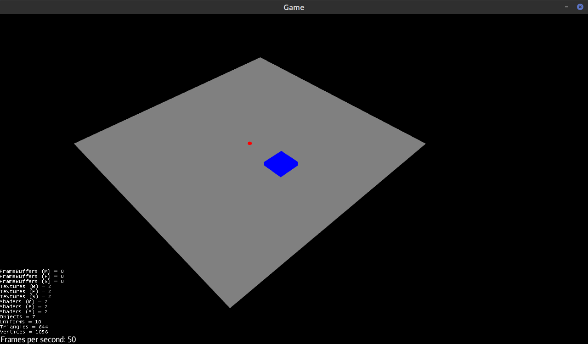

# About

Sample project to build a management game with Kotlin & jMonkeyEngine.

Features include:
* Move camera with holding right click
* Zoom in and out with the mouse wheel
* Switch view with **V** (top view, side view, isometric view)
* Enable/Disable a blueprint with **B** / **ESCAPE**   

# How To
* Build with `./gradlew clean build`
* Run the main class
